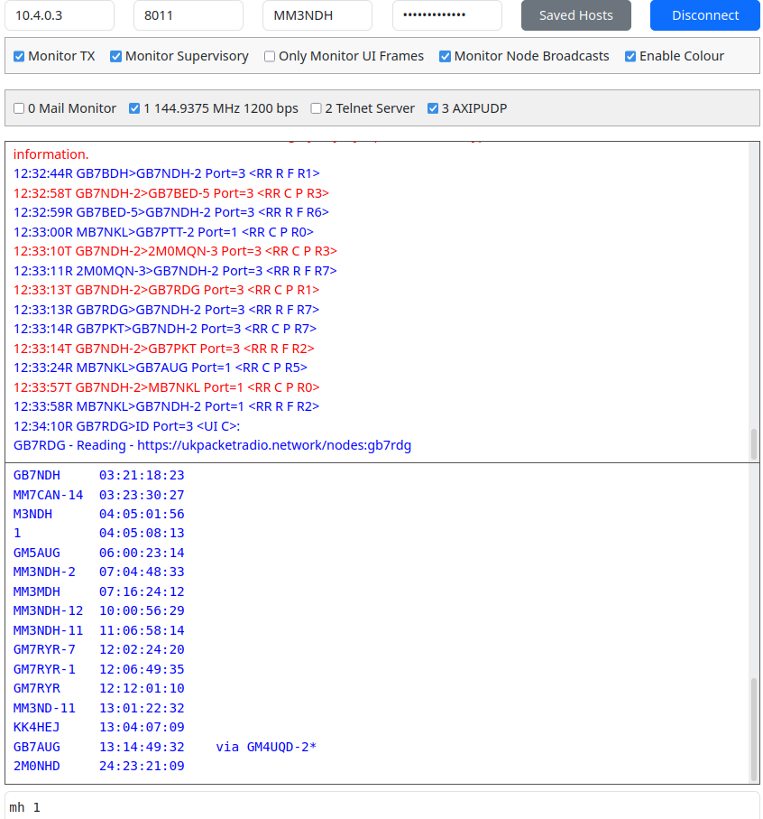

# WebTermTCP

WebTermTCP - Web version of QtTermTCP

1) Clone this repo
2) Download prebuilt binary from [Releases](https://github.com/madpsy/webtermtcp/releases) for your OS/Arch (or build your own)
3) Run the program from within the cloned repo directory (chmod +x it first on Linux/Mac)
4) In a browser go to http://127.0.0.1:8000 (or whatever IP address of the host)

Probably easiest to run this on the same host as BPQ32. Ensure you have the FBB port configured.

Note: Connections to the target host/port are made from the proxy, not the browser itself.

You could run it behind an HTTPS proxy with basic auth and make it Internet accessible easily and safely.

```
Usage of tcpproxy:
  -debug
    	Enable debug logging for hex data and TCP write logs
  -listen-port int
    	Port on which the HTTP server listens (default 8000)
  -web-root string
    	Root directory for static files (default ".")
```



